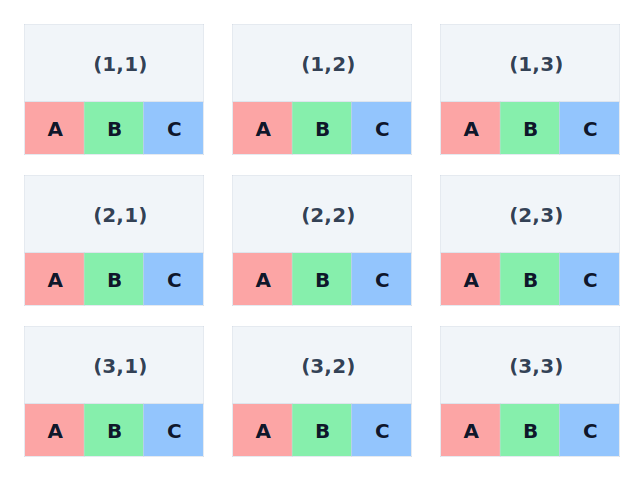
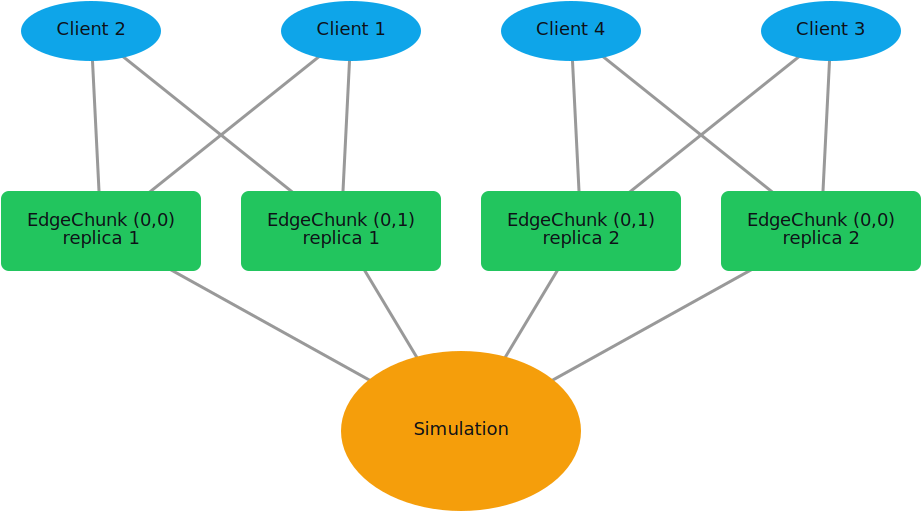
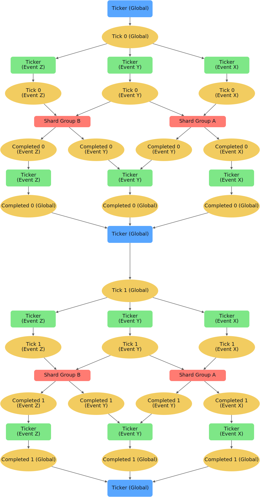

# HiveShard

[](https://codecov.io/gh/hiveshard/HiveShard)

HiveShard is a distributed runtime for deterministic simulations that require partitioning of 2D space.
The goal is to support 100M human actors simultaneously (connected via client endpoints)
AND billions of simulated entities in ONE consistent 2D world.

## Status

HiveShard is in **active development**.

The core architecture is implemented and works with **InMemory hosting**.  
This setup represents the real distributed system, with communication mechanisms replaced by in-process equivalents (e.g. Kafka/TCP -> in-memory messaging).

At the moment:
- Running HiveShard requires [Xcepto.NET](https://github.com/xcepto/Xcepto.NET)
- Containerized and production-grade hosting are **not ready**
- APIs and behavior may still change

This release is intended for **early adopters and downstream experimentation**, not production use.

## Getting Started

**Before you begin:**

This system is built around four core components — *Shard*, *Ticker*, *Edge*, and *Client*.
You must understand their roles and interactions before writing any code.
Please have a look at the individual sections for more detail.

- **Shard** → distributed state per chunk  
- **Ticker** → deterministic time progression  
- **Edge** → client ↔ simulation boundary  
- **Client** → external actor interacting with the system  

### The Environment

You can declare your environment using a fluent interface.
You supply your own class via generic type parameters.

```CSharp
var environment = HiveShardFactory.Create<T>(builder => builder
    .Events(eventBuilder => eventBuilder
        .RegisterEvent<InitialDataEvent>()
        .RegisterEvent<InitialDataResponse>()
    )
    .ShardWorker(workerBuilder => workerBuilder
        .Identify(shardWorker)
        .AddShard<TestShard>()
    )
    .Initialize(initializationBuilder => initializationBuilder
        .AddInitializer<TestShardInitializer>()
    )
    .TickerWorker(tickerWorker => tickerWorker
        .GlobalTicker()
        .Ticker<InitialDataEvent>()
        .Ticker<InitialDataResponse>()
    )
);
```

This environment declaration is then used by the hosting method of your choice to instantiate your simulation.

### Hosting Methods

The same environment declaration can be used with various hosting options.

#### InMemory hosting

This method enables running a whole distributed HiveShard simulation on one node. It is mostly used for test runs and local client simulations.

So far, [Xcepto.NET](https://github.com/xcepto/Xcepto.NET) is the only way to run the declaration. It is a test runtime for distributed systems. Most HiveShard tests use this hosting method. 

A minimal example to run the environment instance is:
```CSharp
await HiveShardTest.Given(environment, builder => { });
```
Since no requirements are stated for the test runtime, the environment will shut down immediately.

You may setup expectations and execute actions that interface with the test environment using HiveShard's own Xcepto adapters. Those are executed in order according to the Xcepto specification ([Xcepto.NET](https://github.com/xcepto/Xcepto.NET)).

Here is an example for expecting a certain state on one of the shard instances:

```CSharp
await HiveShardTest.Given(environment, builder =>
{
    var shardAdapter = builder.RegisterAdapter(new HiveShardShardAdapter(shardWorker, shard));

    shardAdapter.Except<TestShard>(x=> 
        x.ReceivedIncrements == TestShardInitializer.Increments.Sum());
});
```


#### Containerized hosting [WIP]

This method currently requires building clients for each component separately and orchestrating them via docker compose. It is supposed to be a one-click deployment on the locally installed docker runtime.

#### HiveShard platform (Fully managed deployment) [WIP]

This method is currently unavailable. It will enable running multiple deployments (multiple versions, projects, staging environments) on a centralized infrastructure.

## Shards

HiveShard SDK provides a domain focused, event driven API for specifying logic components (HiveShards)
that are then orchestrated onto every single partition (chunk) by the runtime.
Each HiveShard instance holds its own state in memory and information is exchanged between HiveShards via propagation.
```CSharp
public class ShardA: IHiveShard
{
    private readonly IScopedShardTunnel _tunnel;

    public ShardA(IScopedShardTunnel tunnel)
    {
        _tunnel = tunnel;
    }

    public void Initialize(Chunk chunk)
    {
        // all chunks register the event type
        _tunnel.Register<TestEvent>(HandleTestEvent);

        if(chunk == new Chunk(1,1))
            _tunnel.Send(new TestEvent());
    }

    private void HandleTestEvent(Message<TestEvent> message)
    {
        // received message from (1,1)
    }
}
```

Shards `A`, `B` and `C` are each in control of one specific domain.

The orchestration layer then distributes the shard onto every single chunk in the world space. Chunks consume all messages from neighbouring chunks and emit messages to their own chunk. 

Example:
Lets say a `ShardA` class instance on chunk `(1,1)` emits a `TestResponse` event as portrayed in the example above. This event is then consumed by chunks `(1,1), (1,2), (2,1), (2,2)` during the **next tick** cycle. 



Shards may choose to ignore events from certain origin chunks, but it is even more powerful to propagate them to their own neighbours as well. This of course entails checking if a shard has already received the message to begin with.

This can be achieved by attaching a `GUID` to every new piece of information worth propagating. This allows receiving Shards to check (e.g. with the help of a HashSet) for already received messages.

## Client & Edges

HiveShard clients are only connected to nearby chunks via multiple stateful TCP connections.
Server-side client endpoints (called Edges) can be scaled up horizontally (more Edge replicas per chunk) as they are separated from the core simulation.



Edges have authority over what messages are sent from clients to the simulation and at what point in time (what tick). They also control what are messages clients receive from the simulation. 

Edges are also defined with a similar event driven API. A simple fast-forward Edge component might look like this: 

```CSharp
public class TestEdge: BaseEdge
{
    public TestEdge(IEdgeTunnel tunnel)
    {
        // registered once per client
        // even for those that are not connected yet
        tunnel.RegisterEdgeHandler<SimulationEvent>(
            (message, client) => 
            tunnel.SendEdgeEventToClient(
                new ClientUpdateEvent(), client
            );
        });
    }
}
```

In order to have sufficient authority to make decisions over client actions, they need to accumulate state from clients and state from the simulation that is relevant to its chunk.

## Tickers

The core simulation runs in lockstep synchronization with a target of 20hz (20 cycles per second). 

The different components are:
- Global Ticker (global lockstep boundary)
- Distributed Ticker (lockstep boundary per event & shard state hash validator & bus offset manager)
- HiveShards (each class/group is distributed onto each chunk with about 5 replicas each for correctness and fault tolerance)
- Tick events (introduce new lockstep boundaries)
- Completed events (merge new lockstep boundaries for the next cycle)

2 Tick cycles are portrayed in the following diagram. The shard groups are not expanded per chunk and replica for obvious reasons.



## FAQs (about the final architecture)

**Can a single client stall the simulation for others?**

No. Edge components send server-authoritative state to the simulation and control what client input goes into that state.

**Can a single faulty shard replica stall the entire simulation region-wide?**

No. Each component is replicated about 5 times. 
Each replica computes a state hash.  
If at least 3 replicas agree, they form a quorum and continue execution.  
Replicas that diverge from this consensus are terminated, while late but consistent replicas may rejoin.
So the system waits for a quorum of replicas, not for every individual replica.

**Can the simulation break down due to total failure of an entire (HiveShard,chunk) logic component (all replicas)?**

In such rare cases, the simulation would stall globally until a quorum of instances has rebooted from checkpoints and caught up with the stream.