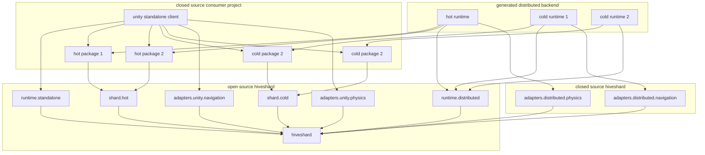

# Components

Hiveshard has many components.
SDKs like `shard.hot` and `shard.cold` are the foundations for specialized **shards**.
These can be hosted on **runtimes**.

Both `runtime.distributed` and `runtime.standalone` can host **shards** as well as **adapters**. 
The distributed runtime can be hosted manually or distributed on managed hiveshard clusters.

**Adapters** support common use cases and can be substituted by a variety of implementations.
For example backend physics can be utilized on a managed hiveshard cluster as well as 
natively on a standalone unity host. 
Some addons are open source, others are **not**. 
However, closed source addons are provided free of charge as docker containers.

